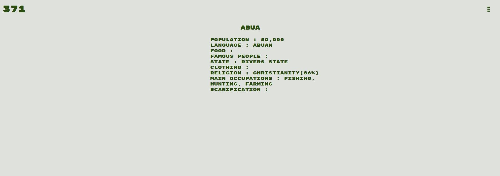
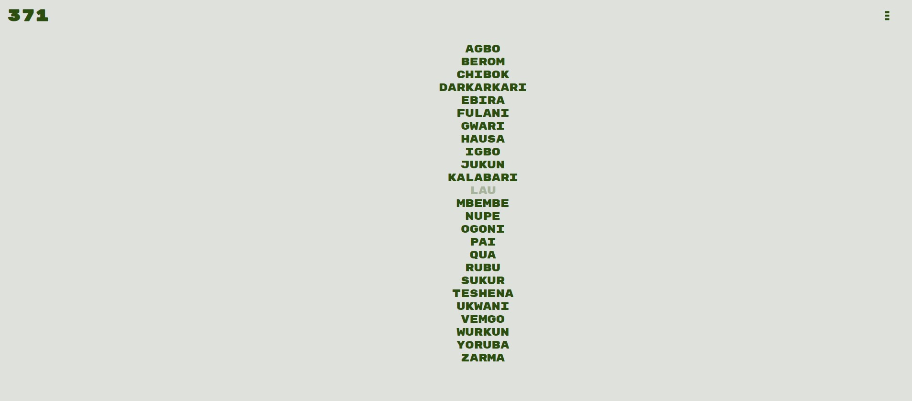

### [371](https://the371tribesofnaija.herokuapp.com/index.html) 
    
#### *371* is a web app dictionary of all the 371 indigenous tribes in Nigeria ####

  

    <h3>Introduction</h3>
  

  
 Nigeria is the most populous black nation on Earth. With a total number of 371 indigenous tribes, it is also one of the most heterogenous and diverse nations on Earth. Despite this rich diversity, there's no single comprehensive resource that showcases the many tribes and their langages and culture on the web. 371 is a web resource that contains every single tribe in Nigeria and lists specific details about them. 

  
 
    <h3> Purpose </h3> 
  

  

    The main purpose of this project is to have a one stop resource of all the indigenous tribes in Nigeria. This one stop resource would have various anthropological and cultural information about each tribe. These include:
  <ul>
    <li>Population</li>
    <li>Language</li>
    <li>Food</li>
    <li>Famous People</li>
    <li>State</li>
    <li>Clothing</li>
    <li>Religion</li>
    <li>Main Occupations</li>
    <li>Scarification</li>
  </ul>
  

  

    <h3>Goals</h3>
  

  
Below provides a checklist of the goals of the project, the ones ticked have been achieved while the unticked ones are yet to be achieved: 

- [x] created a web app directory
- [x] gotten a comprehensive list of all the 371 tribes in Nigeria
- [x] created the site navigation 
- [x] created the structure of each tribe page starting with a particular english alphabet
- [ ] anthropological and cultural information
- [ ] images and other media resources e.g videos
- [ ] a quiz application route whereby users can take quick quizes to test their knowledge of Nigerian tribes
- [ ] a Facebook, Twitter and Instagram page for further engagement
- [ ] containerize the web application

<h3>Contributions</h3>

 You can contribute both ideas and code for this project. We are especially looking for programmers that have an interest in Africaan culture in general and Nigerian culture in particular. You can contact me on github for further information. This project is also accepting donations, the method of donating to this project would be published in the near future.

<h3>Tools</h3> 

 
 

The following tools were using in building this project

<ol>
  <li><b>HTML5</b></li>
  <li><b>CSS3</b></li>
  <li><b>Javascript(ES6)</b></li>
  <li><b>Heroku - for deployment </b></li>
</ol>

Subsequently, we may be moving the site to React but that would still be further down the line. Our immediate concerns are getting more data to fill our backend API and also building the games functionality. 

You can view the site here: https://the371tribesofnaija.herokuapp.com/index.html

