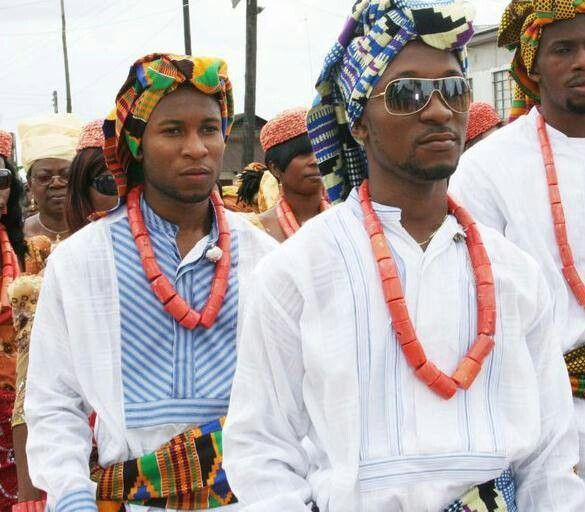

### 371
#### *371* is a web app dictionary of all the 371 indigenous tribes in Nigeria ####

  

    <h3>Introduction</h3>
  

  
 Nigeria is the most populous black nation on Earth. With a total number of 371 indigenous tribes, it is also one of the most heterogenous and diverse nations on Earth. Despite this rich diversity, there's no single comprehensive resource that showcases the many tribes and their langages and culture on the web. 371 is a web resource that contains every single tribe in Nigeria and lists specific details about them. 

You can view the site here: https://the371tribesofnaija.herokuapp.com/index.html
  
[Code](./script.js)
  
🤞
   

